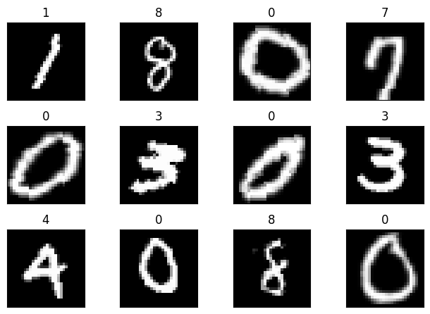
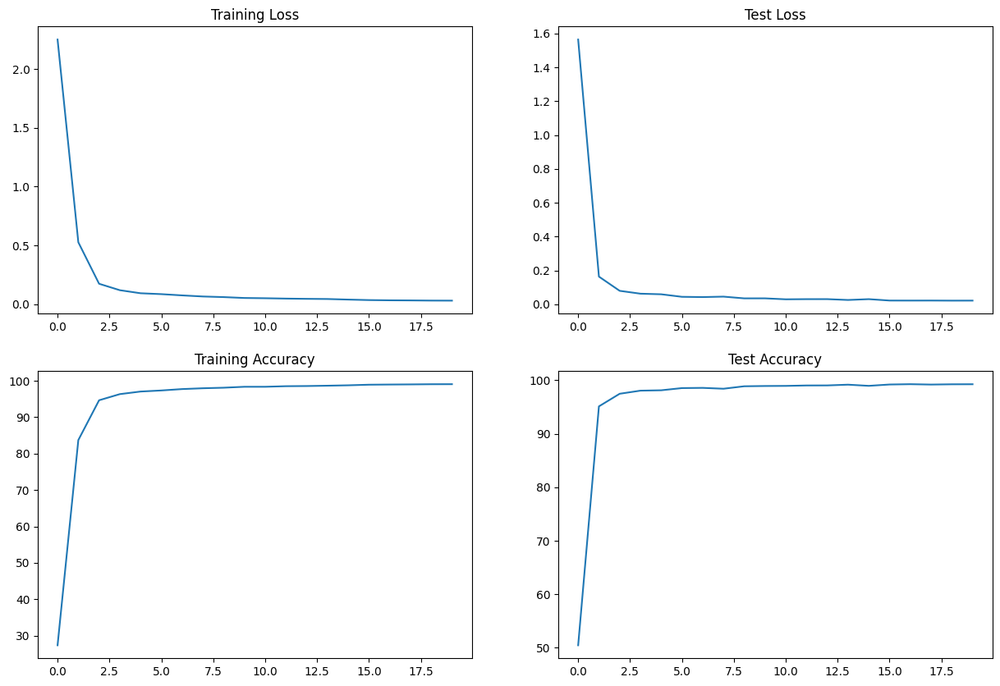
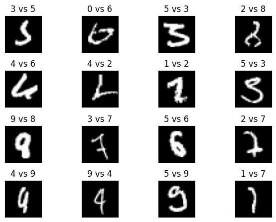

# MNIST classification

## Description

This project includes three Python files: `model.py`, `utils.py`, and `S5.ipynb`. These files are part of a machine learning project for image classification using the MNIST dataset. The project involves training a neural network model to recognize handwritten digits.




## Files

### 1. model.py

This file defines the structure of the neural network model used for image classification. The `Net` class is a subclass of `torch.nn.Module` and consists of several convolutional and fully connected layers. The `forward` method implements the forward pass of the model, and the `summary` method provides a summary of the model's architecture.

```
============================================================================================================================================
Layer (type:depth-idx)                   Input Shape               Output Shape              Param #                   Param %
============================================================================================================================================
Net                                      [1, 28, 28]               [1, 10]                   --                             --
├─Conv2d: 1-1                            [1, 28, 28]               [32, 26, 26]              320                         0.05%
├─Conv2d: 1-2                            [32, 26, 26]              [64, 24, 24]              18,496                      3.12%
├─Conv2d: 1-3                            [64, 12, 12]              [128, 10, 10]             73,856                     12.45%
├─Conv2d: 1-4                            [128, 10, 10]             [256, 8, 8]               295,168                    49.76%
├─Linear: 1-5                            [1, 4096]                 [1, 50]                   204,850                    34.53%
├─Linear: 1-6                            [1, 50]                   [1, 10]                   510                         0.09%
============================================================================================================================================
Total params: 593,200
Trainable params: 593,200
Non-trainable params: 0
Total mult-adds (Units.MEGABYTES): 727.92
============================================================================================================================================
Input size (MB): 0.00
Forward/backward pass size (MB): 0.70
Params size (MB): 2.37
Estimated Total Size (MB): 3.08
============================================================================================================================================
```

### 2. utils.py

The `utils.py` file contains utility functions used in the project. It includes functions for plotting example images, training the model, testing the model's performance, plotting training statistics, and visualizing incorrectly classified examples.

### 3. S5.ipynb

The `S5.ipynb` file is the main script that runs the image classification project. It imports the necessary libraries and modules, sets up the device ('CUDA', 'MPS' or 'CPU') for training, defines data transformations, loads the MNIST dataset, creates data loaders, plots example images, initializes the model, trains the model, tests the model's performance, and visualizes incorrectly classified examples.

## Usage

To run the project, make sure you have the dependencies installed.
```
pip install -r requirements.txt
```
You can execute the `S5.ipynb` notebook to perform the training and testing. Adjust the hyperparameters such as learning rate, momentum, batch size, and number of epochs as desired.

Below is the sample output provided by utils.

### 1. Sample Training and Test Stats

```
plot_stats()
```



### 2. Sample Misclassified Examples:

```
test_show_incorrect(model, device, test_loader)
```


